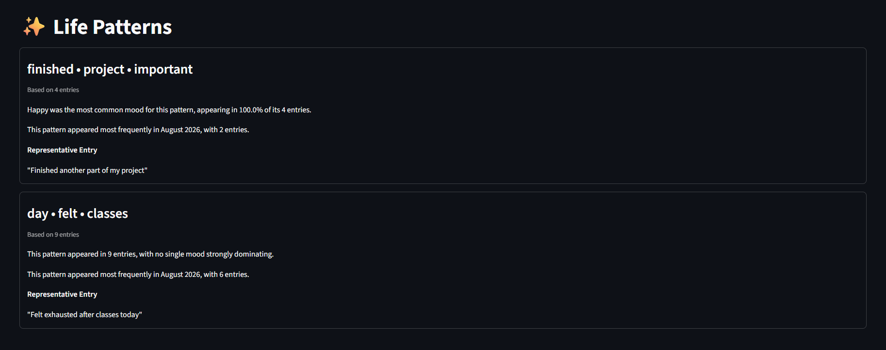
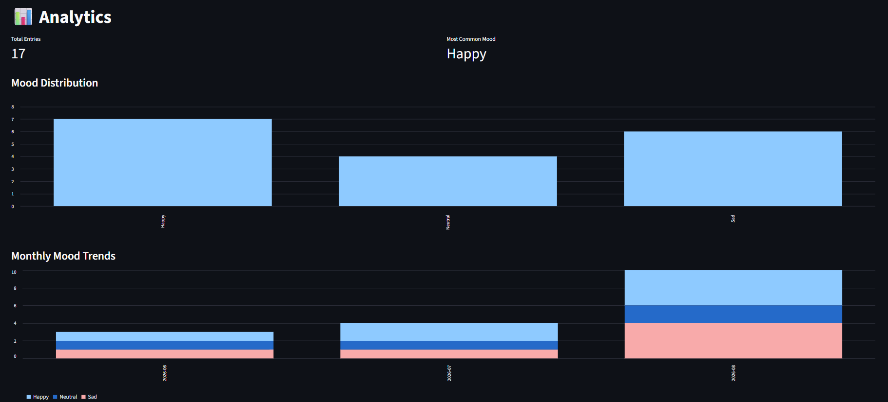
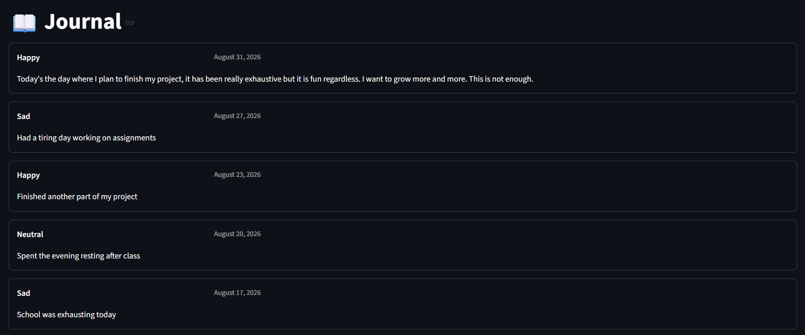
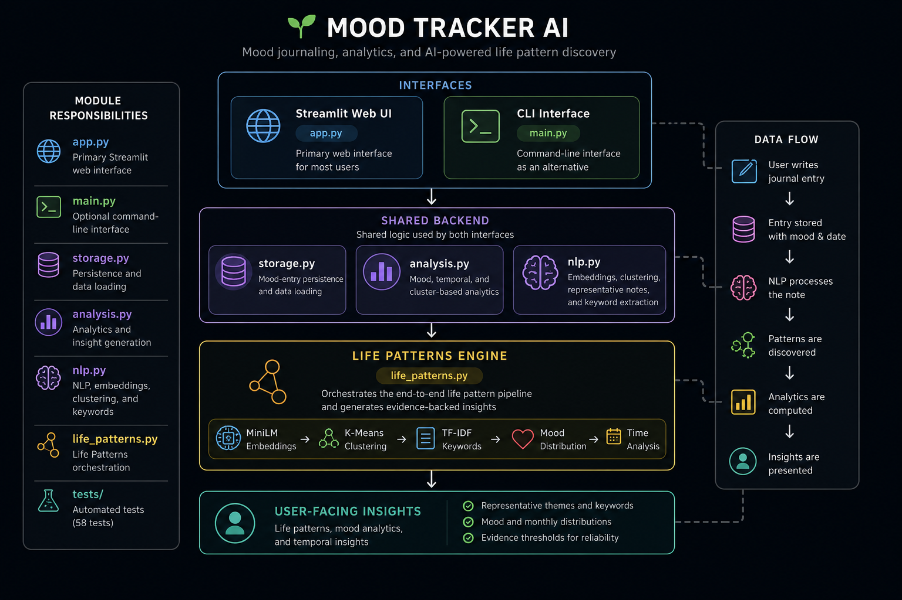

# 🌱 Mood Tracker AI

A mood journaling and analytics application that uses **semantic
embeddings and unsupervised machine learning** to explore recurring
themes across journal entries and relate them to self-reported moods and
time patterns.

**Live Demo:** https://mood-tracker-ai.streamlit.app/

> **Note:** Life Patterns are exploratory associations derived from
> journal history. They are not psychological diagnoses, causal
> explanations, or mental-health predictions.

## Preview

### Life Patterns



[Try the live demo](https://mood-tracker-ai.streamlit.app/)

------------------------------------------------------------------------

## Overview

Traditional mood trackers can show **what moods you recorded**.

Mood Tracker AI goes a step further by exploring:

> **What recurring contexts appear across what I write, and how have
> those contexts coincided with my moods over time?**

Users record their own mood and can optionally provide a journal note.
The application provides conventional mood analytics alongside **Life
Patterns**, an NLP-based feature that groups semantically similar
journal entries and summarizes recurring patterns using evidence from
the user's history.

The user's selected mood remains the source of truth. The AI does
**not** attempt to infer or diagnose the user's emotional state from
their writing.

------------------------------------------------------------------------

## Features

### Mood Journaling

-   Record a self-reported mood
-   Add an optional journal note
-   Automatically timestamp entries
-   Browse journal history through a Streamlit web interface
-   Use the original command-line interface as an alternative

### Mood Analytics

-   View total mood entries
-   Count mood frequencies
-   Identify the most common mood, including ties
-   Explore mood distribution
-   Analyze monthly mood trends
-   Generate time-based mood insights

### Life Patterns

Life Patterns explores recurring semantic contexts across journal
entries.

For each sufficiently supported pattern, the system can provide:

-   Representative keywords
-   A representative journal entry
-   Number of supporting entries
-   Observed mood distribution
-   Most common mood when sufficiently dominant
-   Temporal frequency insights

Patterns with insufficient evidence are not surfaced as established Life
Patterns.

------------------------------------------------------------------------

## Application

### Analytics



### Journal



------------------------------------------------------------------------

## How Life Patterns Works

``` text
Journal Notes
      ↓
SentenceTransformer
all-MiniLM-L6-v2
      ↓
384-dimensional semantic embeddings
      ↓
Silhouette-based cluster-count selection
      ↓
K-Means clustering
      ↓
┌───────────────────────────────┐
│ Representative Entry          │
│ TF-IDF Keywords               │
│ Mood Distribution             │
│ Monthly Distribution          │
└───────────────────────────────┘
      ↓
Evidence Thresholds
      ↓
Life Pattern Summaries
```

### 1. Semantic Embeddings

Journal notes are encoded using the SentenceTransformer model
`all-MiniLM-L6-v2`.

Each note becomes a **384-dimensional semantic embedding**, allowing
entries with similar meanings to be compared beyond exact word overlap.

The embedding model is loaded lazily so pages that do not require NLP
can load without initializing the model.

### 2. Automatic Cluster Selection

The application evaluates candidate values of `K` using the **silhouette
score** and selects the highest-scoring candidate.

### 3. Semantic Clustering

K-Means groups journal entries according to their embedding
representations.

### 4. Representative Entries

For each cluster, the application calculates the Euclidean distance
between each entry embedding and the cluster centroid.

The nearest entry is selected as a representative example of the
discovered pattern.

### 5. Keyword Extraction

TF-IDF is applied independently within each cluster to extract
representative terms while filtering common English stop words.

### 6. Mood and Time Analysis

The discovered cluster labels are combined with the user's self-reported
mood and date history to calculate mood distributions and monthly
frequencies for each pattern.

### 7. Evidence-Based Insights

The system uses minimum-data policies and deterministic summaries to
avoid overstating weak evidence.

It deliberately uses cautious descriptive language such as:

> "Happy was the most common mood for this pattern..."

rather than unsupported causal claims such as:

> "This activity makes you happy."

------------------------------------------------------------------------

## Architecture



The project separates storage, analytics, NLP, visualization, and Life
Pattern orchestration so that both the original CLI and the Streamlit
interface can reuse the same underlying logic.

------------------------------------------------------------------------

## Tech Stack

### Application

-   Python
-   Streamlit
-   pandas
-   NumPy

### Machine Learning and NLP

-   Sentence Transformers
-   `all-MiniLM-L6-v2`
-   scikit-learn
-   K-Means
-   Silhouette Score
-   TF-IDF

### Visualization

-   Streamlit charts
-   Matplotlib

### Testing

-   pytest

------------------------------------------------------------------------

## Testing

The project currently contains **58 automated tests** covering areas
including:

-   Data storage and loading
-   File-writing edge cases
-   Mood analytics
-   Time-based analytics
-   Visualization
-   Embedding generation
-   Cluster fitting
-   Automatic cluster-count selection
-   Representative-note selection
-   Keyword extraction
-   Mood and temporal pattern insights
-   Minimum-data policies
-   Life Pattern orchestration

Life Pattern orchestration tests use mocked dependencies where
appropriate so the integration logic can be tested independently from
the behavior of the embedding model.

Run the complete test suite with:

``` bash
python -m pytest
```

------------------------------------------------------------------------

## Evaluation

The Life Patterns pipeline was evaluated using controlled semantic data
and deliberately overlapping journal entries.

### Controlled Semantic Dataset

A synthetic dataset was created around three intended themes:

-   Academics
-   Gaming
-   Social activity

The system selected **K = 2** rather than the three human-designed
categories.

Candidate silhouette scores were approximately:

  | K | Silhouette Score |
|---:|---:|
| 2 | 0.052 |
| 3 | 0.050 |
| 4 | 0.047 |
| 5 | 0.052 |

The result demonstrated that the numerically highest silhouette score
does not necessarily correspond to the most human-interpretable semantic
grouping.

### Overlapping Dataset

A second dataset deliberately mixed contexts such as:

-   Academics + social activity
-   Gaming + social activity
-   Gaming + academic stress

The observed silhouette scores were approximately:

  | K | Silhouette Score |
|---:|---:|
| 2 | 0.051 |
| 3 | 0.015 |
| 4 | 0.025 |
| 5 | 0.056 |

The system selected **K = 5**.

Some discovered groups were coherent, while others were fragmented or
semantically mixed. These experiments informed the product's evidence
thresholds and cautious interpretation of discovered patterns.

------------------------------------------------------------------------

## ⚠️ Limitations

Life Patterns should be treated as **exploratory semantic groupings**,
not definitive categories.

Current limitations include:

-   Small journal datasets may have weak cluster separation.
-   Silhouette-based selection of `K` is a heuristic rather than proof
    of a uniquely correct number of themes.
-   K-Means performs hard clustering even though a journal entry may
    naturally contain multiple themes.
-   Discovered clusters may reorganize as new journal entries are added.
-   Semantic keywords do not always perfectly describe every entry in a
    cluster.
-   Patterns describe observed associations and should not be
    interpreted as causal psychological conclusions.
-   The current hosted demo uses file-based storage and should not be
    treated as a production multi-user journaling service with
    guaranteed durable persistence.

The application therefore avoids presenting its output as diagnosis,
mental-health prediction, or an explanation of why a user feels a
particular emotion.

------------------------------------------------------------------------

## Getting Started

### Prerequisites

-   Python
-   Git

### 1. Clone the repository

``` bash
git clone https://github.com/Alevrio/Mood-Tracker-AI.git
cd Mood-Tracker-AI
```

### 2. Install dependencies

``` bash
pip install -r requirements.txt
```

### 3. Run the web application

``` bash
streamlit run app.py
```

Then open the local Streamlit URL shown in the terminal.

### Optional: Run the CLI

The project's original command-line interface is still available:

``` bash
python main.py
```

------------------------------------------------------------------------

## 🌐 Deployment

The application is deployed on **Streamlit Community Cloud**.

**Live Demo:** https://mood-tracker-ai.streamlit.app/

The repository includes sample journal entries so visitors can
immediately explore Analytics and Life Patterns.

### Persistence Note

The current portfolio deployment uses file-based storage. It should
therefore be treated as a demonstration rather than a production
multi-user journaling service with guaranteed durable user storage.

A production version would use persistent external storage and separate
user histories.

------------------------------------------------------------------------

## 📁 Project Structure

``` text
Mood-Tracker-AI/
├── app.py
├── main.py
├── storage.py
├── analysis.py
├── visualization.py
├── nlp.py
├── life_patterns.py
├── MoodNoteFileData.txt
├── requirements.txt
├── tests/
│   ├── test_analysis.py
│   ├── test_life_patterns.py
│   ├── test_nlp.py
│   ├── test_storage.py
│   └── test_visualization.py
├── LICENSE
└── README.md
```

### Module Responsibilities

  | Module | Responsibility |
|---|---|
| `app.py` | Primary Streamlit web interface |
| `main.py` | Optional command-line interface |
| `storage.py` | Mood-entry persistence and data loading |
| `analysis.py` | Mood, temporal, and cluster-based analytics |
| `visualization.py` | Matplotlib visualizations |
| `nlp.py` | Embeddings, cluster selection, K-Means, representative notes, and keywords |
| `life_patterns.py` | End-to-end Life Patterns orchestration |
| `tests/` | Automated unit and orchestration tests |

------------------------------------------------------------------------

## Future Improvements

Potential future improvements include:

-   Persistent database-backed user storage
-   Authentication and separate user histories
-   Improved clustering methods for overlapping semantic themes
-   More robust cluster-quality and stability evaluation
-   Better handling of journal entries containing multiple themes
-   Expanded longitudinal analytics
-   Additional UI and accessibility refinement

------------------------------------------------------------------------

## Engineering Takeaways

This project evolved from a small command-line mood tracker into a
tested and deployed AI-enabled web application.

Key engineering lessons from the project included:

-   Separating interface code from storage and analysis logic
-   Designing reusable backend functions for both CLI and web interfaces
-   Using semantic embeddings instead of relying only on lexical
    similarity
-   Evaluating unsupervised-learning assumptions rather than treating
    clustering output as ground truth
-   Using evidence thresholds to avoid overstating weak patterns
-   Mocking expensive ML dependencies in orchestration tests
-   Testing real failure cases discovered during development
-   Keeping AI-generated insights descriptive rather than causal

------------------------------------------------------------------------

## 📄 License

See [`LICENSE`](LICENSE) for licensing information.
